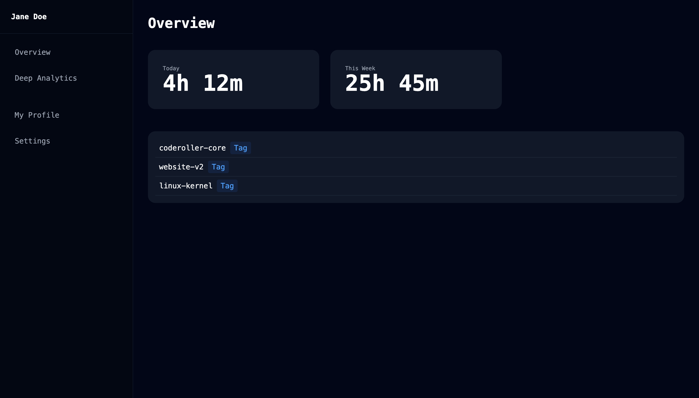
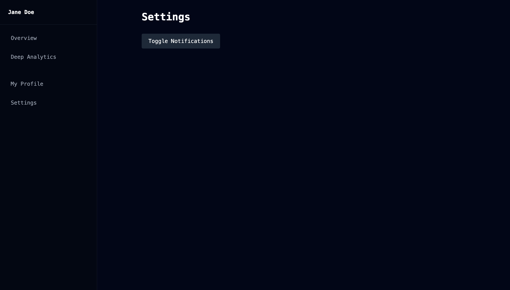

<div align="center">

# 🐹 Coderoller Web UI


**The local-first, privacy-focused developer time tracker and analytics dashboard.**

A lightweight, self-hosted web interface and background CLI daemon that tracks active coding time across multiple IDEs, compiles local SQLite metrics, and serves beautiful dashboard insights without tracking spyware.

<br />

[](LICENSE)
[](https://react.dev)
[](https://www.typescriptlang.org/)
[](https://vitejs.dev)
[](https://tailwindcss.com)
[](CONTRIBUTING.md)

[Documentation](#documentation-directory) · [Quick Start](#-quick-start) · [Features](#-features) · [Architecture](#-architecture) · [Contributing](#-contributing) · [License](#-license)

</div>

---

## 💡 Why Coderoller?

Most time-tracking tools fall into two camps: **manual stopwatch trackers** that require you to click start and stop (which developers inevitably forget), or **invasive spyware clients** that take random screenshots, monitor active window titles, and upload your entire system usage history to proprietary cloud servers. Coderoller exists to bridge the gap—providing fully automated, highly detailed tracking that remains entirely on your machine.

We started Coderoller because logging hours for invoices or tracking project velocity shouldn't feel like a compromise on privacy or developer flow. The goal was to build a system that runs silently in the background, hooks into standard filesystem events and IDE focus cycles, and stores data in a simple database file that you fully control.

By keeping the platform local-first, Coderoller avoids latency, works completely offline, and eliminates the risk of sensitive client names, repository paths, and development schedules leaking to third-party databases. The codebase is fully open-source, enabling you to inspect every connection, fork the frontend, and run custom queries directly against your tracked time.

For developers seeking to optimize their focus, teams coordinating on billable hours, or freelancers generating audit-ready work reports, Coderoller offers a premium, zero-friction tracking experience. It integrates seamlessly into standard developer workflows without overhead, leaving you free to focus entirely on writing code.

Beyond baseline activity logging, Coderoller addresses the developer experience directly. Command-line interactions are swift and natural, query results load in milliseconds, and the companion web interface is designed with a sleek, minimalist dashboard aesthetic. There are no heavy background services or electronic telemetry monitors checking your device's activity; only the code editor focus bindings interact with the local tracker.

Furthermore, Coderoller respects your environment. It avoids bloated client apps, instead running a single optimized executable as a background daemon. By compiling directly against your active workspace files, it generates rich telemetry showing you which languages, branches, and files consume the majority of your time, providing unmatched diagnostic value without demanding external server validation.

Finally, we believe that open source projects must welcome community ownership. Coderoller is designed to be forkable, customizable, and easily deployable as a standalone local instance. Developers can write their own database hooks, connect their own custom dashboard tools, and build scripts that work directly against their generated data charts.

Additionally, Coderoller's architecture is highly modular. If you decide to migrate from SQLite to Postgres or another database engine, the storage drivers can be swapped out easily. Similarly, the frontend client can be customized using Tailwind utilities to match your company's design layout or custom reporting requirements.

---

## 🖼️ Screenshots

| CLI Terminal Interface | Web Analytics Dashboard | Settings & Integrations |
|:---:|:---:|:---:|
|  |  |

---

## ✨ Features

### Core Tracking Engine

| Module | Description |
| :--- | :--- |
| **Background Daemon** | Low-overhead process running in the background, monitoring filesystem activity and editor focus switches. |
| **IDE Focus Binding** | Integrations for VSCode, JetBrains, and Neovim capture precise active development periods instead of idle window time. |
| **Auto-Idle Detection** | Detects typing and cursor inactivity, automatically pausing the tracking session when you step away. |
| **Branch Awareness** | Automatically ties active coding sessions to the currently checked-out Git branch. |

### Web Interface & Analytics

| Module | Description |
| :--- | :--- |
| **Real-time Overview** | Live dashboard displaying total work hours, active project distribution, and current coding velocity. |
| **Granular Breakdown** | Visual charts showing coding time sorted by language, active Git branch, repository, and individual file path. |
| **Weekly Velocity Charts** | Comparative historical tracking charts mapping productivity trends across standard work cycles. |
| **Project Milestones** | Track coding progress against user-configured milestones and timeline deadlines directly on the UI. |

### Data & Cloud Platform

| Module | Description |
| :--- | :--- |
| **Local-First Database** | Stores all historical activity securely on your local file system in a queryable SQLite database. |
| **Offline Performance** | Runs completely independent of network state, ensuring uninterrupted tracking during outages or flights. |
| **Encrypted Cloud Sync** | Optional E2E encrypted sync to backup servers for users requiring multi-device reporting. |
| **Data Export Wizard** | Export your tracked developer metrics to raw CSV, JSON, or formatted SQLite sheets with a single click. |

---

## 🛠️ Tech Stack

| Technology | Purpose |
| :--- | :--- |
| **Vite 8** | Modern frontend tooling, providing blazing-fast HMR and highly optimized production builds. |
| **React 19** | Declarative rendering engine driving the web-based interactive reporting dashboard. |
| **TypeScript 6** | Statically typed language wrapper ensuring component type safety and clean interfaces. |
| **Tailwind CSS v4** | Utility-first CSS engine for unified styling tokens, layout responsiveness, and dark mode configuration. |
| **SQLite3** | Lightweight local database for time-tracking log storage and quick queries. |
| **Node.js** | Runtime environment supporting CLI tool scripts and server-side previewing. |

---

## 🚀 Quick Start

### Prerequisites

To build and run Coderoller Web UI, ensure your development environment matches:
- **Node.js** v18.0.0 or later (Node.js LTS recommended)
- **npm** v9.0.0 or later (or Yarn v1.22+)
- **SQLite3** (locally installed, or relies on standard Node/C++ runtime bindings)
- **Git** (for version control and branch checking)

### Installation

1. **Clone the Repository**
   Download the web UI components:
   ```bash
   git clone https://github.com/coderoller/coderoller-web.git
   cd coderoller-web
   ```

2. **Install Dependencies**
   Install standard packages and dev compilation scripts:
   ```bash
   npm install
   ```

3. **Configure Environment Variables**
   Initialize your `.env` configuration file from the provided example template:
   ```bash
   cp .env.example .env
   ```

4. **Initialize Local Database**
   The Coderoller CLI daemon initializes the SQLite database automatically. For the web UI dashboard to compile data correctly, ensure your database path is referenced inside your `.env` configuration file:
   ```bash
   # Add your database directory destination
   DB_PATH=~/.coderoller/db.sqlite
   ```

5. **Start Development Server**
   Spin up the local Vite development instance:
   ```bash
   npm run dev
   ```
   Open the application at [http://localhost:5173](http://localhost:5173) to view your local tracking records.

6. **Production Build**
   To compile and run the optimized production bundle locally:
   ```bash
   npm run build    # Compiles static assets to /dist
   npm run preview  # Serves compiled output on local preview port
   ```

### Command Line Reference

Once you have installed the Coderoller system, you can use the core CLI commands to check, start, or configure the daemon:

- **Start Background Daemon**
  ```bash
  coderoller daemon start
  ```
- **Stop Background Daemon**
  ```bash
  coderoller daemon stop
  ```
- **Check Status**
  ```bash
  coderoller status
  ```
- **Show Today's Time Stats**
  ```bash
  coderoller today
  ```

### IDE Bindings Configuration

Once the CLI daemon is running, you can connect your code editor to transmit focus events:
- **VSCode**: Install the **Coderoller Integration** extension from the marketplace. Config your local endpoint port to `5173` (or default configuration).
- **Neovim**: Add the Lua setup package `coderoller.nvim` to your package manager (e.g., Lazy or packer) and configure it in your `init.lua`.
- **JetBrains**: Install the Coderoller jar plugin from the IntelliJ marketplace.

### Troubleshooting Setup Issues

*   **Port 5173 Conflicts**: If Vite returns a port conflict, customize the port by setting `PORT=5174` inside your `.env` file and restart the development server.
*   **Database Lock Errors**: If the daemon and dashboard access the database simultaneously on Windows, ensure your sqlite bindings support multi-process WAL mode by enabling it in `~/.coderoller/config.json`:
    ```json
    {
      "journal_mode": "WAL"
    }
    ```
*   **File System Watcher Exhaustion**: On Linux, if you see watcher limit errors, increase your `inotify` watches limit using:
    ```bash
    echo fs.inotify.max_user_watches=524288 | sudo tee -a /etc/sysctl.conf && sudo sysctl -p
    ```

---

## ⚙️ Environment Variables

Configure your local instance using the following properties in your `.env` file:

| Variable | Required | Default | Description |
| :--- | :---: | :--- | :--- |
| `DB_PATH` | **Yes** | `~/.coderoller/db.sqlite` | Absolute filesystem path referencing your local SQLite database file. |
| `PORT` | No | `5173` | Local network port used to run the Vite dashboard. |
| `SUPER_SECRET_ADMIN_TOKEN` | No | - | Custom authorization token for synchronizing local stats to cloud backups. |
| `STRIPE_API_KEY` | No | - | Optional Billing integration endpoint API key for multi-tenant deployments. |

---

## 🗄️ Database Architecture

Coderoller utilizes local SQLite for database management. By default, your time tracking logs are saved to:
`~/.coderoller/db.sqlite`

### Database Setup & Initialization
- **Automatic Initialization**: On starting the background watcher (`coderoller daemon start`), the database engine checks if a database file exists. If missing, it creates `db.sqlite` automatically at the configured destination path.
- **Manual Maintenance**: You can directly inspect, backup, or query the database using standard SQLite clients:
  ```bash
  sqlite3 ~/.coderoller/db.sqlite "SELECT * FROM sessions LIMIT 10;"
  ```
- **Migrations**: Database schema upgrades are managed internally by the CLI daemon on startup. If schema changes are introduced in a new version, migrations are run sequentially before writing new tracking logs.

### Database Tables Schema

```sql
CREATE TABLE sessions (
  id TEXT PRIMARY KEY,
  project_name TEXT NOT NULL,
  start_time DATETIME NOT NULL,
  end_time DATETIME NOT NULL,
  duration_seconds INTEGER NOT NULL,
  git_branch TEXT
);

CREATE TABLE events (
  id INTEGER PRIMARY KEY AUTOINCREMENT,
  session_id TEXT REFERENCES sessions(id),
  file_path TEXT NOT NULL,
  language TEXT NOT NULL,
  event_type TEXT NOT NULL, -- e.g., 'focus_in', 'file_write'
  timestamp DATETIME NOT NULL
);
```

---

## 🏗️ Architecture

```
   ┌─────────────────────────────────────────────────────────────┐
   │                    IDE Editor Workspace                     │
   │      (VS Code Plugin  ·  Neovim Lua  ·  JetBrains Plugin)    │
   └──────────────────────────────┬──────────────────────────────┘
                                  │ Focus / File Change Events (JSON)
                                  ▼
   ┌─────────────────────────────────────────────────────────────┐
   │                  Coderoller CLI Daemon (Rust)                │
   └──────────────────────────────┬──────────────────────────────┘
                                  │ Writes tracking logs
                                  ▼
   ┌─────────────────────────────────────────────────────────────┐
   │             Local SQLite Database (~/.coderoller/db.sqlite)   │
   └──────────────────────────────┬──────────────────────────────┘
                                  │ Reads compiled logs
                                  ▼
   ┌─────────────────────────────────────────────────────────────┐
   │                Web UI Dashboard (Vite / React 19)           │
   │               Served on localhost:5173 in Browser           │
   └────────────────────────────────────────────────────────┘
```

The Coderoller architecture consists of three independent components:
1. **IDE Plugins**: Lightweight editor scripts capture focus changes, file saves, and typing updates. They push micro-events containing project names, filenames, and language tags to the daemon.
2. **CLI Daemon**: A low-latency background process running locally. It batches events, validates them against your idle timeouts, and writes compiled time segments directly to SQLite.
3. **Web UI Dashboard**: A responsive, Vite-powered single-page application that reads the SQLite file to compile, organize, and visualize your development patterns.

---

## 📂 Folder Structure

```
code-roller-website/
├── .github/                 # GitHub configurations, workflow pipelines, and templates
├── blog/                    # Static blog pages and release announcement articles
├── docs/                    # Technical installation and commands documentation
│   ├── commands.html        # Interactive CLI commands dictionary page
│   ├── faq.html             # Frequently Asked Questions document
│   ├── index.html           # Technical documentation main page
│   ├── install.html         # Comprehensive installation guide
│   └── privacy.html         # Data architecture security details
├── public/                  # Public assets, icons, and logo images
├── src/                     # Main source code directory
│   ├── landing.js           # CLI typing animation simulation logic
│   └── style.css            # Tailwind directives and layout styles
├── index.html               # Project marketing homepage
├── pricing.html             # Pricing models detail page
├── dashboard.html           # Main web dashboard layout entry point
├── analytics.html           # Detailed analytics dashboard page
├── settings.html            # Settings configuration template
├── package.json             # Build commands and dependency listings
└── vite.config.js           # Multi-page Rollup compiler options
```

---

## 🎨 Design Philosophy

*   **Simplicity First**: Development tools should have zero configuration. Coderoller sets up with a single CLI command, initializing database paths, background watchers, and web outputs without manual configuration loops.
*   **Optimal Performance**: Developers expect tools with near-zero resource utilization. The daemon is optimized to utilize less than 0.5% CPU resources, and the Web UI builds down to a minified file size serving client requests instantly.
*   **Strict Security & Privacy**: We believe in self-custody of personal data. All code files, directories, and work schedules stay locally encrypted on your device. You are the sole controller of your time records.
*   **Accessibility**: High-contrast modern dark styling, responsive layouts across screens, and key navigation support make tracking data accessible to all developers.
*   **Developer Experience**: Visual charts represent exact statistics without complex queries. Installing integrations is a one-click step, and environment controls match standard workflows.
*   **Scalability**: The database is structured to support millions of tracked events without query degradation, keeping dashboards fast even after years of continuous execution.

---

## ⚡ Performance Targets

We optimize the frontend bundle and background tracking engine to adhere to strict parameters:

| Metric | Target | Verification Method |
| :--- | :--- | :--- |
| **First Contentful Paint** | < 0.8 s | Chrome DevTools Performance Audit |
| **Time to Interactive** | < 1.5 s | Lighthouse Client Assessment |
| **Bundle Size (gzip)** | < 200 KB | Vite production rollup report |
| **Lighthouse Performance Score** | ≥ 98 | Production build lighthouse run |
| **SQLite Query Execution** | < 5 ms | Internal telemetry timing log |

---

## 🗺️ Roadmap

- [x] **v1.0** — Core background daemon development, file system watchers, and basic database layer.
- [x] **v1.1** — Client-side static Web UI dashboard mockup with HTML/CSS rendering.
- [x] **v1.2** — Full integration with Vite, Tailwind CSS compilation, and responsive styling.
- [ ] **v2.0** — Recharts dynamic dashboard integration, and offline local sqlite query binding.
- [ ] **v2.1** — Full launch of Neovim, VSCode, and JetBrains IDE plugin packages.
- [ ] **v2.2** — End-to-end encrypted backup synchronization server launch.
- [ ] **v3.0** — Self-hosted team metrics aggregation server development.

---

## 📖 Documentation Directory

| Document | Path | Purpose |
| :--- | :--- | :--- |
| **CLI Reference** | [/docs/commands.html](file:///Users/tushar/Desktop/code-roller-website/docs/commands.html) | List of daemon configurations and runtime commands. |
| **Installation Guide** | [/docs/install.html](file:///Users/tushar/Desktop/code-roller-website/docs/install.html) | Extended steps for installing on Windows, Linux, and MacOS. |
| **Privacy Policy** | [/docs/privacy.html](file:///Users/tushar/Desktop/code-roller-website/docs/privacy.html) | Architectural security breakdown of the local-first storage format. |
| **FAQs** | [/docs/faq.html](file:///Users/tushar/Desktop/code-roller-website/docs/faq.html) | Answers for manual overrides, SQLite corruption fixes, and customization support. |

---

## 🤝 Contributing

We welcome contributions from developers of all backgrounds! To get started:

1. **Fork** this repository.
2. Create a feature branch:
   ```bash
   git checkout -b feature/amazing-feature
   ```
3. Commit your modifications:
   ```bash
   git commit -m "feat: add support for custom project tracking groups"
   ```
4. Push changes to your branch:
   ```bash
   git push origin feature/amazing-feature
   ```
5. Open a **Pull Request** referencing your implementation branch.

Please review our contributing rules before submitting patches:
- Match standard Javascript formatting rules (managed by `oxlint`).
- Ensure code components are responsive across desktop and mobile screens.
- Keep commits descriptive, conforming to the [Conventional Commits](https://www.conventionalcommits.org) spec.

### Naming Conventions & Code Style

- Use camelCase for javascript files and variables, and kebab-case for CSS/HTML classes.
- Ensure all functions have minimal JSDoc descriptions.
- Check code layout before staging changes using the local linter tool:
  ```bash
  npm run lint
  ```

---

## 🔒 Security

If you identify a security vulnerability in Coderoller, please **do not** open a public issue. Email security reports directly to `security@coderoller.dev`. We will investigate within 24 hours and coordinate a public release fix patch.

---

## 📝 License

Coderoller Web UI is open-source software licensed under the [MIT License](LICENSE).

---

## 💖 Acknowledgements

Built with passion and built on:
- [React 19](https://react.dev)
- [Vite 8](https://vitejs.dev)
- [Tailwind CSS v4](https://tailwindcss.com)
- [SQLite3](https://sqlite.org)
- [Lucide Icons](https://lucide.dev)

---

<div align="center">
  <sub>Made with care by the open-source Coderoller community.</sub>
</div>
